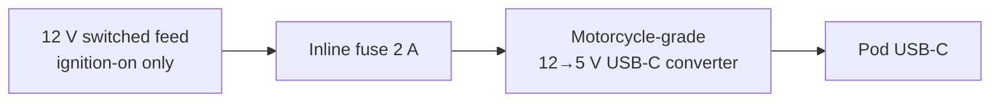

# Power & mounting

## Power chain

- **Use an ignition-switched feed**, so the pod can't drain the battery when parked. Find one on your bike's wiring diagram, for example the feed to an existing accessory socket, the horn, or the tail light, or use a relay triggered by an ignition-switched wire. Don't run it straight from the battery.
- **Fuse within 10–15 cm of the tap.**
- **The converter must survive automotive transients**: load dump, cranking dips to about 6 V, and alternator ripple. Buy one sold specifically as a motorcycle USB charger. Bare buck modules die or pass the spikes through.
- Expect a draw of about **150–300 mA at 5 V** with the backlight at full. That's trivial for the bike's charging system.

### Brownouts and resets

The pod may reset when you crank the engine. Two layers handle this:

1. **Firmware.** Navigation state is persisted, so a reset costs about 3 s (see [architecture](../design/architecture.md#resilience-requirements)).
2. **Optional hardware.** A small LiPo on the Waveshare battery header rides through cranking dips completely.

!!! warning "LiPo in the sun"
    A LiPo sitting in direct Jakarta sun in a sealed case is a real risk. If you add one:

    - Use a quality cell with protection.
    - Keep it on the shaded side of the case.
    - Let the firmware cut off charging above about 45 °C. The ESP32-S3 has an internal temperature sensor you can use as a rough proxy.

## Enclosure

- **Light-coloured** ASA (best UV and heat resistance) or PETG. Avoid PLA, which softens in a parked bike's sun.
- Recessed display behind a **2 mm clear window with anti-glare film**, plus a short **visor/hood**, about 10–15 mm deep, over the top half.
- Gasket the window (thin silicone or foam tape). Seal the USB-C entry with a cable gland or potting.
- Add a small **Gore-style vent patch**, or at least a labyrinth vent at the bottom, so condensation can escape.
- **Conformal coat** the board. Mask the USB-C, buttons and connectors first.
- Use thread inserts (M2/M2.5) rather than screwing into plastic.

## Mounting

- Place it where your eyes go naturally: close to the instrument cluster, angled about 15–25° toward you.
- Options:
    - A Tripper-style bracket clamped at the handlebar or riser
    - A 1" RAM-style ball on a mirror-stem or bar clamp
- **Vibration.** Rigid mounts transmit engine buzz, which blurs the screen and fatigues solder joints. Use a rubber-damped ball mount, and strain-relieve every wire inside the case with hot glue or a cable tie point.
- Route the USB-C cable along the existing loom, leaving slack for full steering lock both ways. Check this with the bars at full lock.
