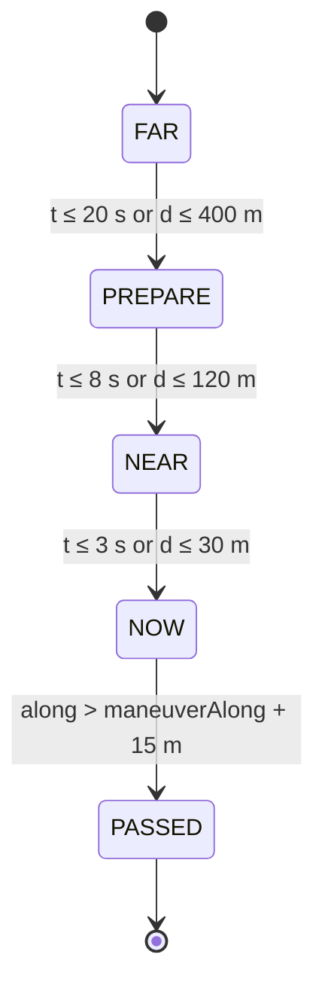

# Navigation algorithms

Everything here lives in `firmware/lib/navcore` as pure C++ and is unit-tested on the host.

## 1. Local metric projection

At route scale, an **equirectangular projection** around a reference latitude is accurate to well under 1 m over a few kilometres, and it is cheap:

```cpp
// meters per degree at reference latitude
constexpr double R = 6371008.8;
struct LocalFrame {
  double lat0_rad, cos_lat0;
  Vec2 toXY(double lat, double lon, double lat0, double lon0) const {
    return { (lon - lon0) * DEG2RAD * R * cos_lat0,   // x east
             (lat - lat0) * DEG2RAD * R };            // y north
  }
};
```

Re-center the frame on the current fix whenever you match, so errors never accumulate. Use haversine only for total distances and long-range sanity checks.

## 2. Map matching (snap to route)

The route is a polyline `P[0..N-1]`. Precompute the cumulative distance `C[i]` along the route in metres, in `float`, when the bundle loads.

**Windowed, forward-biased search.** Keep `lastSeg`. On each fix:

1. Search segments `[lastSeg − 5, lastSeg + 60]`. Clamp the window, and widen it to the whole route if `state == LOST`.
2. For each segment, project the fix onto it, clamping `t` to [0, 1]. The cost is:

    ```
    cost = perpDist
         + 25 m × headingPenalty      // only when speed > 8 km/h
         + 5 m  × max(0, lastSeg − seg)   // discourage going backwards
    headingPenalty = (1 − cos(Δheading)) / 2   // 0 aligned … 1 opposite
    ```

3. Pick the lowest cost. The result gives `seg`, `t`, `perpDist`, and `along = C[seg] + t × |segment|`.

The heading penalty is what saves you on **stacked roads** (a flyover above a road, parallel collector lanes) and on routes that loop back past themselves.

!!! warning "Don't snap through hairpins"
    The search is limited to segments within about 60 indices ahead, and `along` can't jump forward by more than `speed × dt × 1.5 + 30 m` per fix. That stops the match leaping to a later pass of the same road.

## 3. Progress, prompts and the trigger state machine

```
dToNext   = C[nextManeuver.point_index] − along
timeToNext = dToNext / max(speed, 2.0 m/s)
```

Each maneuver moves through these phases exactly once:



| Phase | Screen |
|---|---|
| FAR | Big arrow + distance (rounded: 50 m steps under 1 km, 0.1 km above) + next road name |
| PREPARE | Same, plus an accent ring |
| NEAR | **Junction snapshot** + live dot + distance bar |
| NOW | Snapshot with the ring flashing |
| PASSED | Advance to the next maneuver and go back to FAR |

Rules:

- Use **hysteresis**. Once a phase is entered it can't go back. The exception is off-route, which resets everything.
- If the next maneuver is closer than about 150 m after the current one, show a small **"then ↰"** chip during NEAR/NOW. The thresholds are tuning values in `navcore/config.h`. Tune them on real rides.

## 4. Projecting the live dot onto a snapshot

The snapshot was rendered in **Web Mercator** at a known `(lat_c, lon_c, zoom, bearing)` with a 512-px tile convention (MapLibre/Mapbox). The center is the maneuver point.

```cpp
// Web Mercator "world pixel" coords at given zoom, 512-px tiles
Vec2 worldPx(double lat, double lon, double zoom) {
  double ws  = 512.0 * std::pow(2.0, zoom);
  double x   = (lon + 180.0) / 360.0 * ws;
  double phi = lat * DEG2RAD;
  double y   = (1.0 - std::log(std::tan(phi) + 1.0 / std::cos(phi)) / M_PI) / 2.0 * ws;
  return {x, y};                                // y grows south
}

// Screen coords (0..240) of a lat/lon on a snapshot
Vec2 toScreen(double lat, double lon, const Snap& s) {
  Vec2 c = worldPx(s.lat, s.lon, s.zoom);
  Vec2 p = worldPx(lat, lon, s.zoom);
  double dx = p.x - c.x, dy = p.y - c.y;
  double b  = s.bearing * DEG2RAD;               // map rotated so bearing points up
  double sx =  dx * std::cos(b) + dy * std::sin(b);
  double sy = -dx * std::sin(b) + dy * std::cos(b);
  return { 120.0 + sx, 120.0 + sy };
}
```

Sanity checks, which are unit tests:

- A point due **north** of center with `bearing = 0` lands straight **above** center.
- A point due **east** of center with `bearing = 90` lands straight **above** center.
- A point due **east** with `bearing = 0` lands to the **right**.

Draw the dot as a filled circle with an outline. Draw an arrow-shaped marker instead when heading is valid, rotated by `heading − bearing`. Dots outside the 120-px radius are clamped to the edge as an "approaching" indicator.

!!! tip "Use the snapped position for the dot"
    Use the *snapped* position, not the raw fix. Raw GNSS jitter makes the dot dance off the road at junctions, which is exactly where you're looking at it.

## 5. Off-route detection

```
offRoute candidate = perpDist > 40 m  (or > 60 m when HDOP > 2)
confirm after 4 s continuously; clear after 3 s back under 25 m
```

While off-route:

- Show the **bearing and distance to the nearest point ahead on the route**. Search the whole route, preferring indices ≥ `lastSeg`.
- Keep the matcher in `LOST` (full-route search) until it re-acquires.
- Later milestone: if the phone is connected over BLE, request a reroute and hot-swap the bundle.

## 6. Heading

- Above 8 km/h, use GNSS course over ground.
- Below that, hold the last good heading. Optionally fuse in IMU yaw-rate (the Waveshare board has a QMI8658) to rotate the held heading while you creep through a junction.
- Don't use a magnetometer on a bike. The engine and frame make it useless without careful calibration.

## 7. GNSS dropouts

When fixes stop or HDOP is above 5:

- For up to 10 s, advance `along += lastSpeed × dt` (dead reckoning along the route).
- After that, freeze progress and show a "GPS" warning icon.
- When fixes come back, run a full re-match within ±300 m of the dead-reckoned position.
