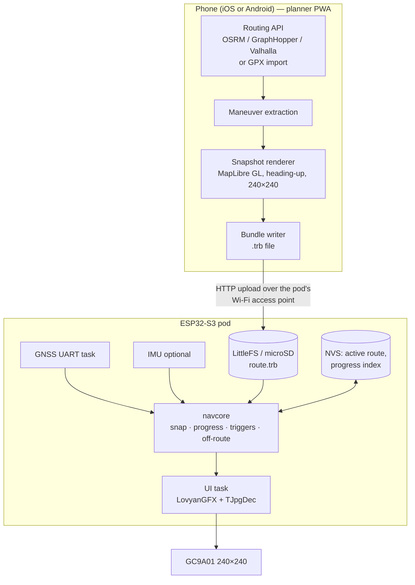

# Architecture

## Principle: plan on the phone, navigate on the device

Every phone-dependent navigation pod has the same weak point: the live link. That includes the stock Tripper, Beeline, and the Chronos/Google Maps forwarders. When the BLE link drops, the app gets killed in the background, or the phone overheats, the pod goes blank.

This design moves the dependency to **before the ride**:

| Concern | Where it lives | Needs network? |
|---|---|---|
| Route calculation | Phone (planner PWA) | Yes, or import a GPX made offline |
| Junction map snapshots | Phone (rendered once) | Yes, while planning |
| Positioning | Device (own GNSS) | No |
| Progress along route, turn prompts | Device | No |
| Off-route detection | Device | No |
| Rerouting | Phone (optional, later milestone) | Yes |

## System diagram



## Firmware layering

The **`navcore`** library is pure C++17. It has no Arduino and no ESP-IDF headers. That is the most important structural rule in the project, for two reasons:

- It can be unit-tested on the host (`pio test -e native`). Claude Code can then verify the logic without any hardware.
- A **simulator** can replay recorded NMEA logs against a bundle and print the prompts the device would show.

```
firmware/
  lib/navcore/      ← pure C++: geo math, bundle parser, matcher, trigger state machine
  lib/hal/          ← thin wrappers: GNSS reader, display, storage, buttons, backlight
  src/              ← tasks, screens, Wi-Fi upload server, wiring it all together
  test/             ← Unity tests (native env)
tools/
  sim/              ← host CLI: bundle + NMEA log → event timeline
```

## Runtime tasks (FreeRTOS)

| Task | Rate | Core | Job |
|---|---|---|---|
| `gnss` | event-driven (5–10 Hz) | 0 | Parse NMEA/UBX and publish a `Fix` to a queue |
| `nav` | per fix | 0 | Update `navcore` state and publish a `NavState` |
| `ui` | 20–30 fps max, dirty-only | 1 | Render the current screen |
| `net` | only in upload mode | 0 | Wi-Fi AP + HTTP server for bundle upload |

Wi-Fi is **off while riding**. It only runs in upload mode, which you enter with a long-press at boot or when no route is loaded. That saves power and avoids RF interference with the GNSS.

## Resilience requirements

- **Brownouts while cranking.** The board can reset when the engine starts. The active route ID and the last matched segment index are persisted to NVS about every 10 s, so navigation resumes within a few seconds of a reboot.
- **GNSS loss** (tunnels, flyovers). Progress is held, and distance is dead-reckoned at the last speed for up to about 10 s. A "GPS lost" indicator appears after that.
- **Corrupt upload.** The bundle has a CRC. A failed upload never replaces the current active route.
