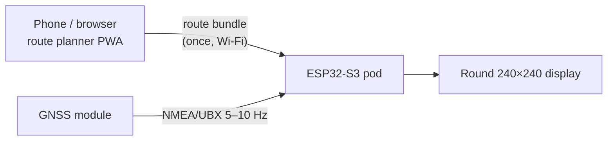
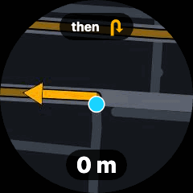

# Tripper DIY

A Royal Enfield Tripper–style navigation pod for the TVS Ronin, built on an **ESP32-S3** and a **1.28" round 240×240 GC9A01 IPS display**.

The device is **offline-first**. You plan a route on the phone before the ride and upload it to the device once. After that, the device navigates on its own using its own GPS. The phone can stay in your pocket, lose signal, or run flat.



<p align="center"></p>

**[Try the live demo](https://kabuldasa.github.io/tripper/#demo)**: the route planner and an emulated pod, running in your browser.

## What it does

- **Turn-by-turn without a phone link.** It shows an arrow, the distance and the street name for the next maneuver.
- **Junction snapshot.** When you get close to a maneuver, the screen switches to a pre-rendered, heading-up map of the junction, with a **live position dot** drawn on top.
- **Time-based prompts.** Alerts fire at roughly 8 s and 3 s before the turn at your current speed, rather than at fixed distances.
- **Off-route detection.** If you leave the route, it shows a "return to route" arrow. Rerouting needs the phone.
- **USB-C power** from the bike's 12 V through a proper motorcycle-grade converter.

## How to use these docs

| If you want to… | Read |
|---|---|
| Hand the build to Claude Code | `CLAUDE.md` in the repo root, plus the [Project plan](project-plan.md) |
| Buy parts | [Shopping list](build/shopping-list.md) |
| Wire it up | [Hardware & wiring](build/hardware.md) and [Power & mounting](build/power-and-mounting.md) |
| Understand the core logic | [Navigation algorithms](design/algorithms.md) and [Route bundle format](design/bundle-format.md) |
| See what others built | [Example projects](reference/examples.md) |

## Preview these docs locally

```bash
pip install mkdocs-material
mkdocs serve        # http://127.0.0.1:8000
```

!!! note "Status"
    This is a design and plan, written October 2026. Prices and part availability change, so check them before you buy.
