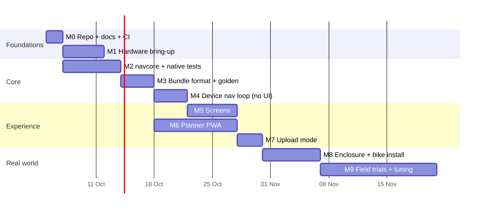

# Project plan

This plan is written to be executed **milestone by milestone with Claude Code** (`claude` in the repo root). `CLAUDE.md` tells Claude Code the rules. This page tells it *what* to build and *how to know it's done*.

## Scope

| In scope (v1) | Later | Out of scope |
|---|---|---|
| Offline route bundle, on-device GNSS, arrow + junction snapshot screens, off-route warning, Wi-Fi upload, USB-C power | BLE upload, phone-assisted reroute, Chronos live mode, OTA, multi-route library | Full on-device map rendering, voice, screen mirroring |

## Inputs

- **Example projects** to study first: [reference/examples.md](reference/examples.md). Read moto2000 (Tripper replacement) and IceNav (standalone GPS nav) before M3.
- **Shopping list:** [build/shopping-list.md](build/shopping-list.md). Order before M1. GNSS shipping is the long pole.
- **Build instructions:**
    - [Hardware](build/hardware.md)
    - [Power & mounting](build/power-and-mounting.md)
    - [Firmware](build/firmware.md)
    - [Planner](build/planner.md)
    - [Testing](build/testing.md)

## Milestones

Each milestone ends with **acceptance criteria** that are checkable. Software milestones are verified by tests that Claude Code can run itself. Hardware steps need you.

The dates are illustrative. M2/M3/M6 are pure software and can run in parallel with waiting for parts.

---

### M0 — Repo, docs, CI

- Monorepo layout: `firmware/`, `planner/`, `tools/`, `docs/`, `mkdocs.yml`, `CLAUDE.md`.
- GitHub Actions:
    - `pio test -e native`
    - `pio run -e waveshare128 -e devkit_n16r8`
    - `npm test` in `planner/`
    - `mkdocs build --strict`

**Accept:** CI is green on an empty skeleton, and `mkdocs serve` shows these docs.

### M1 — Hardware bring-up 🧑‍🔧 *(needs you)*

Follow [hardware § bench bring-up](build/hardware.md#bench-bring-up-order). Claude Code writes the sketches; you flash them and report the results.

**Accept:**

- Full-screen push at 30 fps or more
- Backlight PWM works
- GNSS shows a fix with ≥ 8 satellites outdoors at 5 Hz
- A 240×240 JPEG decodes from LittleFS in under 60 ms
- Buttons register short and long press

### M2 — `navcore` (pure C++) + native tests

Implement [algorithms](design/algorithms.md) §1–7 in `firmware/lib/navcore`:

- `geo` (local frame, haversine, bearing)
- `mercator` (worldPx, toScreen)
- `matcher` (windowed snap with heading penalty)
- `triggers` (phase state machine)
- `offroute`
- `deadreckon`

**Accept:**

- `pio test -e native` passes, with tests covering:
    - [ ] Projection sanity cases (N/bearing 0 → up; E/bearing 90 → up; E/bearing 0 → right)
    - [ ] Snap on a straight line, an L-turn, a U-shaped route passing itself, and parallel roads 15 m apart with opposite headings
    - [ ] Phase order FAR→PREPARE→NEAR→NOW→PASSED with no regressions, at 20, 60 and 100 km/h
    - [ ] Off-route confirm/clear hysteresis
    - [ ] Dead-reckoning for 10 s, then freeze
- No Arduino/ESP-IDF includes anywhere under `lib/navcore` (enforced by a CI grep).

### M3 — Bundle format + golden fixture

- `navcore/bundle.*`: a zero-copy-ish parser with every validation rule from [bundle-format](design/bundle-format.md#validation-device-side).
- `tools/trb.py`: writer + inspector (Python) that builds `tools/fixtures/demo.trb` from a GPX and placeholder JPEGs.
- `tools/sim`: replay CLI ([testing](build/testing.md#replay-simulator)).

**Accept:**

- The golden fixture parses identically in Python and C++.
- Fuzzed or corrupted files are rejected without crashing (native test + ASan).
- The simulator produces the expected timeline for a synthetic NMEA ride generated from the demo route.

### M4 — Device navigation loop (debug UI)

Wire up the FreeRTOS tasks ([architecture](design/architecture.md#runtime-tasks-freertos)) with a text-only debug screen showing: phase, d, t, speed, perpDist, maneuver #.

**Accept:**

- Bench: replaying an NMEA file over USB serial into the GNSS task produces the same timeline as `tools/sim`.
- Persisted progress resumes correctly after a forced reset.

### M5 — Screens

Implement the [screen list](design/screens.md#screen-list) with LovyanGFX sprites, the junction screen (JPEG background + live dot), and day/night themes.

**Accept:**

- Each screen has a screenshot dumped from the sprite to serial or a file, committed as `docs/img/screens/*.png`.
- The junction screen holds ≥ 20 fps while the dot moves.
- Heap and PSRAM stay stable over a 1-hour replay loop (no leaks).

### M6 — Planner PWA

Build the [planner](build/planner.md): routing provider (OSRM first), maneuver mapping, MapLibre snapshot renderer, bundle writer, GPX import.

**Accept:**

- Vitest is green, including the golden-file contract test against `tools/fixtures/demo.trb`.
- Works in iOS Safari and Android Chrome, and is installable.
- A 50-maneuver route generates in under 30 s on a mid-range phone.

### M7 — Upload mode

SoftAP + HTTP server + on-device uploader page + QR screen + atomic swap.

**Accept:**

- Uploading a 2 MB bundle from an iPhone and an Android phone takes under 15 s each.
- A corrupted upload leaves the previous route active.
- Wi-Fi is fully off after leaving upload mode.

### M8 — Enclosure + bike install 🧑‍🔧

Follow [power & mounting](build/power-and-mounting.md). Claude Code can generate a parametric enclosure (OpenSCAD/CadQuery) in `hardware/enclosure/` from measured board dimensions.

**Accept:** the install part of the field checklist passes: power on ignition only, resumes after cranking, cable clears full steering lock.

### M9 — Field trials + tuning 🧑‍🔧

Record the rides on the [recording list](build/testing.md#recording-rides), add each one as a replay test with expectations, and tune `navcore/config.h`.

**Accept:**

- Every recorded ride passes its expectations in CI.
- Missed or late prompts on a full ride: fewer than 1 per 50 maneuvers.
- Field checklist fully ticked.

---

## Later milestones (v2)

- **M10 BLE:** upload over BLE (no Wi-Fi switching), plus phone-assisted reroute that hot-swaps the bundle.
- **M11 Chronos live mode:** a fallback when no bundle is loaded.
- **M12 OTA:** firmware updates through upload mode.
- **M13 Route library:** microSD, pick a route on the device.

## Risks

| Risk | Impact | Mitigation |
|---|---|---|
| LCD unreadable in midday sun | High | AG film + hood early (M8 prototype print during M5). Consider a brighter panel or AMOLED for v2 |
| Heat blackout in a parked bike | Medium | Light-coloured ASA case, vent, firmware dims the backlight above ~60 °C internal temp |
| GNSS poor in high-rise corridors / stacked roads | Medium | M10 module, heading-penalised matcher, replay tests from real Jakarta rides |
| Browser mixed-content blocks upload | Medium | Device-served uploader page (M7 design) |
| Brownout resets | Low | NVS persistence, optional LiPo |
| Tile/API terms for offline snapshots | Low | MapLibre + OpenFreeMap. Check terms if using Mapbox |
